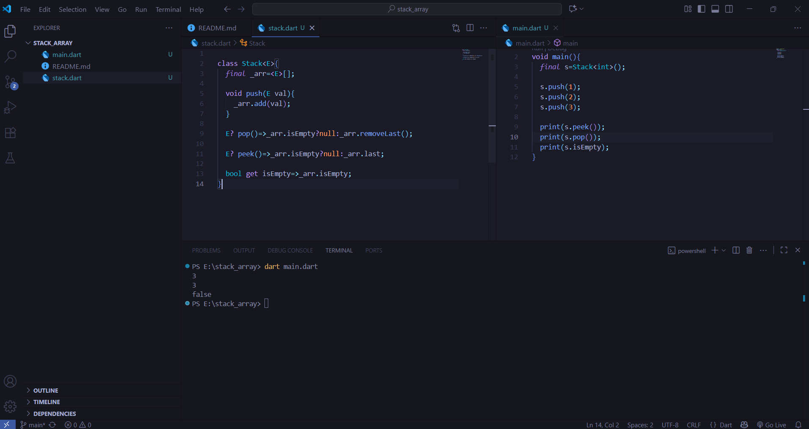

# Stack Implementation in Dart

This repository contains a simple generic **Stack** implementation in Dart.

---

## Features

- Generic type support (`Stack<E>`)
- `push()` → Add an element
- `pop()` → Remove and return the top element (safe, returns null if empty)
- `peek()` → View the top element without removing (safe, returns null if empty)
- `isEmpty` → Check if the stack is empty

---

## Running Instructions

1. **Clone the repository:**

```bash
git clone https://github.com/ajlank/stack-array.git
cd stack-array

dart main.dart



